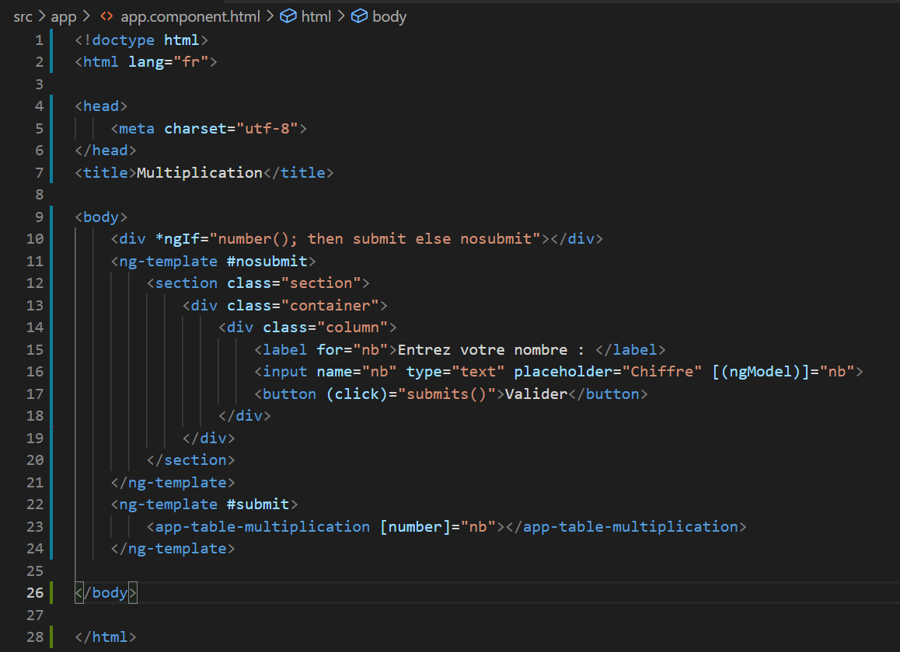
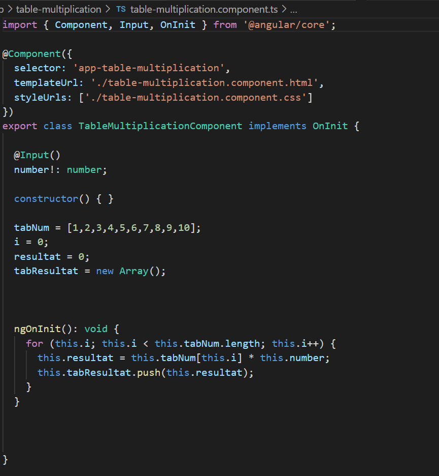
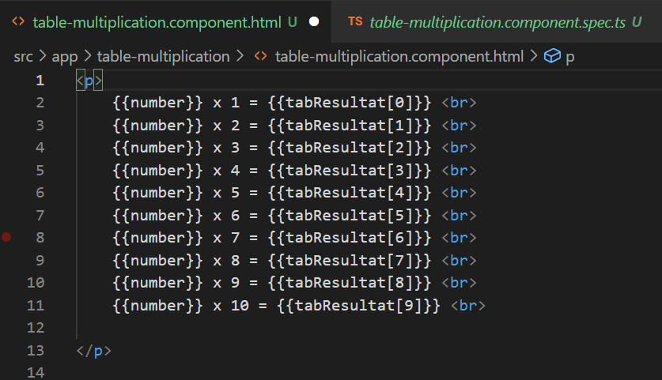

Introduction:

Ce TP a pour objectif de vous permettre de consolider les premiers concepts présentés dans les premiers TD d’introduction à Angular.

Objectif:

On souhaite concevoir une application web qui affiche une table de multiplication (1 à 10), selon
une valeur soumise par l’utilisateur.

Partie 1:

Nous devion faire une  application mono-page. La page principale fera usage du composant
TableMultiplication dont le rôle est de présenter une table de multiplication.

J'ai lancé mon projet avec la commande "ng new table --style=css --routing=false".J'ai commencé a céer le composant "table" :il exploite une valeur qui lui est transmise par son parent:un nombre entier qui correspond à la table de multiplication à afficher.Grace à la commande  "ng generate component components/table".

Voici le code pour le formulaire qui sera dans app.component.html.

Le composant table-multiplication est divisé en plusieur parties:

Il exploite une valeur qui lui est donnée ,un nombre entier qui correspond à la table de multiplication à afficher.

Le code pour l'affichage de la table de multiplication.

